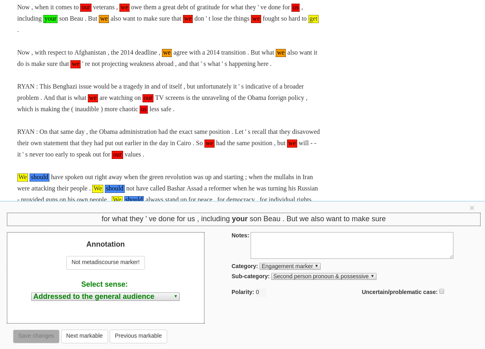
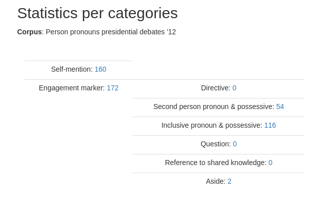
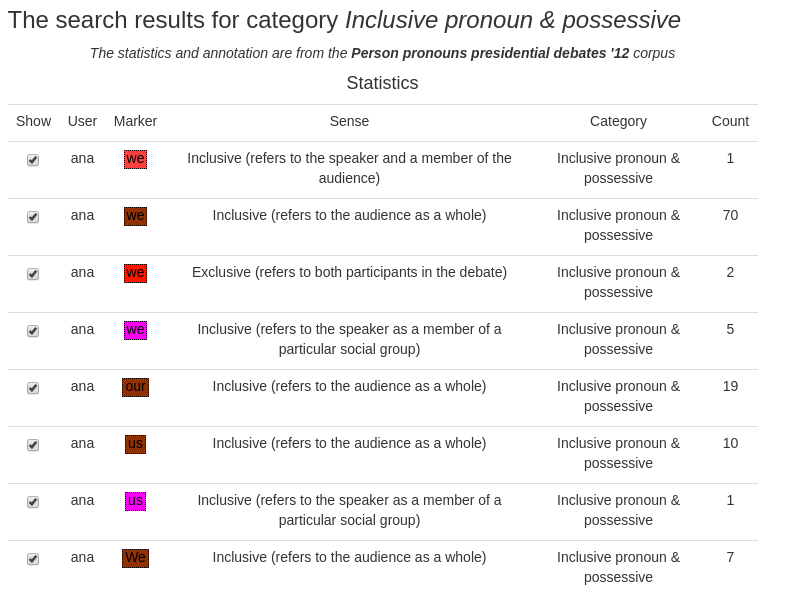
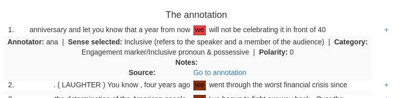

meta_discourse_annotator
========================

# Introduction

Meta discourse annotator is an annotation tool that can be used to assign categories
to predefined sets of words and phrases in texts. Initially the tool was created
to annotate meta discourse markers, but it evolved not to be limited to those. 
It can be used for any task where these set of markables (words or expressions) are
known apriori or can be added iteratively during the annotation. Each of these
expressions is expected to have one or more senses. In addition, the annotator 
can assign it to predefined categories that are shared with other expressions.
In addition to the annotation part, the tool can be used to analyse the annotation
and produce reports. 

# Screenshots

# Contact

For bugs and feature requests please 
[submit an issue](https://github.com/dinel/metadiscourse-annotator/issues). You can
always contact me by email on <dinel@dinel.org.uk>.

