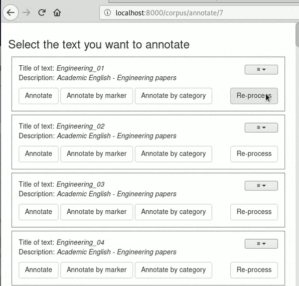

# Using pins

Users are able to pin texts in the *Select text screen*. The pinned texts will
appear before the rest of the texts. In order to pin a text, users will need
to select from the menu () the *Pin 
text* option. If a text is already pinned, users will be able to select *Unpin text*
in order to unpin a pinned text. A pinned text will be indicated by the 
 icon. 

The order of texts is not changed when a text is pinned, only when the page is 
refreshed. The following screencast demonstrates how pinning texts works. 

